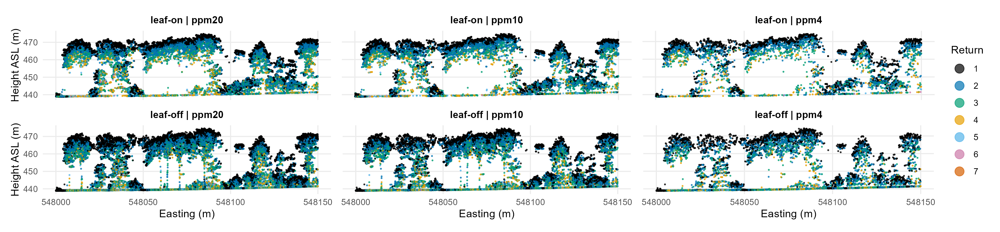

# Leaf-on vs. Leaf-off ALS

Comparison of leaf-on vs. leaf-off airborne laser scanning (ALS) data for forestry applications.

## Context

ALS has become integral to forest inventory and monitoring. Federal agencies typically acquire data in winter, while Germany’s Digital Twin initiative collects data also during vegetation periods. This shift raises critical questions regarding forest parameter estimation and model transferability between leaf-on and leaf-off states.

## Area-Based Estimation of Forest Inventory Attributes

### Metrics Comparison

-   Comparison of ALS-derived metrics between leaf-on and leaf-off datasets
-   Investigation of which metrics are most affected by phenological state
-   Analysis of metric stability across seasons

### Modeling Forest Inventory Attributes

-   Access which data is better suited to model forest inventory attributes, e.g. growing stock volume, above ground biomass, tree density, basal area, and quadratic mean diameter
-   Cross-seasonal model transferability and bias assessment

## Data involved

-   leaf-on (September 2023) and leaf-off (March 2024) ALS data (Riegl VQ-780 II-S/Riegl VQ-780i)
-   sample based forest inventory (“Betriebsinventur”) of Lower Saxony

Input data are not included in this repository. Download from
[GRO Link]
and place the contents as follows:

*Cross sections of leaf-on and leaf-off point clouds at different points per squaremeter (ppm).*
